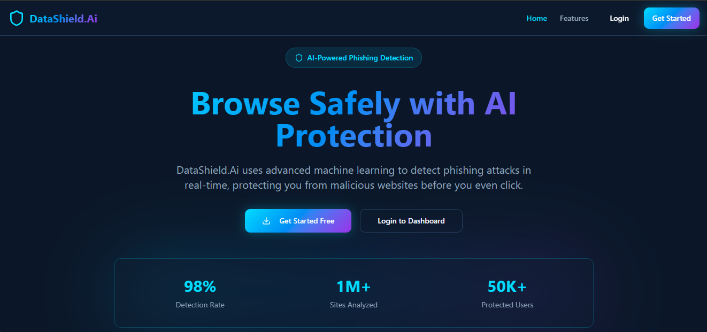
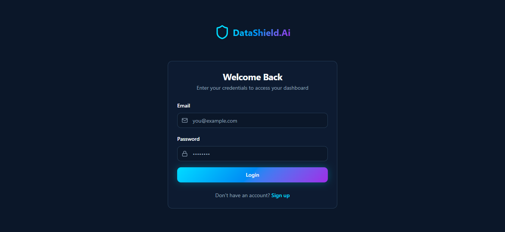
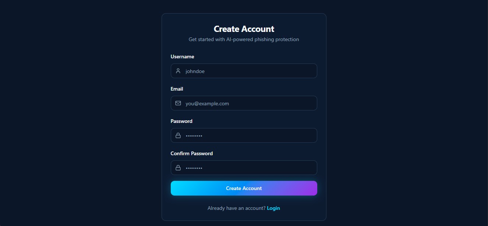

#  DataShield.AI — Frontend  
### **AI-Powered Phishing Detection & Safe Browsing**

DataShield.AI is a modern cybersecurity platform that uses machine learning to detect phishing websites in real-time.  
This is the **frontend** of the platform — built with **React + TypeScript + Vite**, featuring a clean UI, fast performance, and deep API integration with the detection engine.

---

## 🚀 **Live Preview**
> (Add link after deployment)

---

## 🖼️ **UI Preview**

### **Homepage**




---

## 🛡️ **Key Features**

- 🔍 **Real-time URL Scanning Interface**
- ⚡ Fast & responsive UI with **Vite + React**
- 🎨 Modern styling using **TailwindCSS + shadcn-ui**
- 📊 Dynamic result visualization (Safe / Warning / Malicious)
- 🔐 Secure Authentication (Login / Register pages)
- 🧩 Integrated with DataShield Browser Extension UI
- 📱 Fully responsive for all screen sizes

---

## 🛠️ **Tech Stack**

| Technology | Usage |
|-----------|--------|
| **React + TypeScript** | UI development |
| **Vite** | Ultra-fast build tool |
| **Tailwind CSS** | Styling |
| **shadcn-ui** | Component system |
| **Axios** | API calls |
| **React Router** | Frontend routing |

---

## 📁 **Project Structure**

  DataShield-Frontend/
├── src/
│ ├── components/
│ ├── pages/
│ ├── hooks/
│ ├── services/
│ ├── utils/
│ └── assets/
├── public/
├── package.json
└── README.md

---

## ⚙️ **Getting Started**

### **1. Clone the repository**
```bash
git clone <YOUR_GIT_URL>
cd DataShield-Frontend
### **2. Install dependencies**
```bash
npm install
### **3. Run the development server**
npm run dev
### **3. App will run at:**
http://localhost:8000/

🔧 Available Scripts

| Command             | Description              |
| ------------------- | ------------------------ |
| `npm run dev`       | Start dev server         |
| `npm run build`     | Build for production     |
| `npm run build:dev` | Dev mode build           |
| `npm run preview`   | Preview production build |
| `npm run lint`      | Run ESLint               |

## ⚙️ **🌐 API Integration**

### **This frontend connects with the backend ML phishing detection API:**
```bash
POST /api/scan-url
